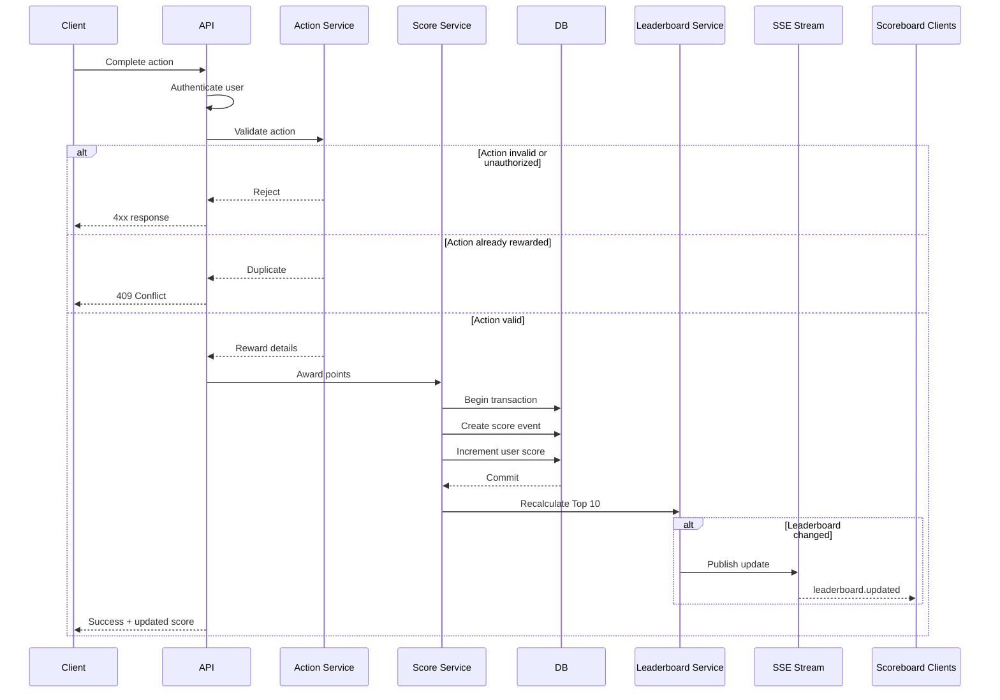

# Live Scoreboard Backend Module

## 1. Overview

This module manages user scores and the live Top 10 scoreboard.

A user performs an action in the application. Once the backend confirms that the action was completed successfully, the user's score is increased and the leaderboard is updated.

The important rule is that the frontend must not be able to decide the score value or directly update a user's score.

### Main responsibilities

- Validate that the user is authenticated.
- Validate that the action is valid and eligible for points.
- Update the user's score safely.
- Prevent duplicate score rewards.
- Return the current Top 10 users.
- Push leaderboard changes to connected clients.

The actual logic of the user action itself is outside this module.

---

## 2. Proposed Flow



### Design note

The score update should happen as part of the backend action flow rather than through a generic `/increase-score` endpoint.

This removes a large part of the attack surface. The frontend only asks to perform an action; the backend decides whether that action deserves points.

---

## 3. API

### Complete an action

```http
POST /api/actions/{actionId}/complete
Authorization: Bearer <token>
```

The client should not send:

```json
{
  "userId": "123",
  "points": 100
}
```

The authenticated user comes from the access token/session, and the number of points comes from backend rules.

### Sample response

```json
{
  "scoreAwarded": 10,
  "totalScore": 420
}
```

### Expected errors

| Status | Reason |
|---|---|
| 401 | User is not authenticated |
| 403 | User cannot perform this action |
| 404 | Action does not exist |
| 409 | Action was already rewarded |
| 422 | Action is valid but not eligible for points |

---

## 4. Leaderboard API

```http
GET /api/leaderboard
```

Example response:

```json
{
  "users": [
    {
      "rank": 1,
      "userId": "u123",
      "displayName": "Alice",
      "score": 1520
    }
  ]
}
```

Only the Top 10 users are returned.

A deterministic secondary sort should be used when two users have the same score.

For example:

```sql
ORDER BY score DESC, id ASC
LIMIT 10;
```

### Consideration remove this later

The actual tie-breaking rule is a product decision. `id ASC` is a default standin for now, but for fairness matters, this rule should be defined later

---

## 5. Live Updates

The client loads the leaderboard once using:

```http
GET /api/leaderboard
```

It then subscribes to:

```http
GET /api/leaderboard/stream
```

The stream uses Server-Sent Events.

Example:

```text
event: leaderboard.updated
data: {"users":[...]}
```

### Why SSE

SSE fits this requirement better than WebSocket because communication is only needed from server to client.

**SSE**

- simpler implementation;
- native browser reconnect support;
- enough for leaderboard updates.

Tradeoff:
- server-to-client only.

**WebSocket**

- supports two-way realtime communication.

Tradeoff:
- more connection and infrastructure handling;

### Note
Unless 2-way realtime communication is needed, SSE is a better fit here.

---

## 6. Score Update and Duplicate Protection

The score update must be transactional.

```text
BEGIN

1. Verify that this action has not already been rewarded.
2. Create a score event.
3. Increment the user's score.

COMMIT
```

If any step fails, the whole transaction is rolled back.

Recommended tables:

```text
users
----------------
id
display_name
score
created_at
updated_at
```

```text
score_events
----------------
id
user_id
action_id
action_type
points
created_at
```

For actions that can only be rewarded once:

```text
UNIQUE(user_id, action_id)
```

### Design note

Duplicate protection should be enforced in the database, not only in application code.

Two identical requests may arrive at almost the same time. A database constraint is the final protection against both being accepted.

If some actions are repeatable, the uniqueness rule will need to include the relevant execution or occurrence identifier instead of only `action_id`.

---

## 7. Score Update

The score should be incremented directly in the database:

```sql
UPDATE users
SET score = score + :points
WHERE id = :userId;
```

Avoid this pattern:

```text
SELECT score
calculate new score
UPDATE score
```

Two requests can read the same value and overwrite each other.

### Note

The database should handle the increment atomically. This keeps the implementation simple and avoids unnecessary locking logic in the application layer.

---

## 8. Leaderboard Update

For the first implementation, the leaderboard can be queried directly from the main database:

```sql
SELECT id, display_name, score
FROM users
ORDER BY score DESC, id ASC
LIMIT 10;
```

After a successful score update, the backend evaluates the Top 10.

If the leaderboard has changed, an SSE event is published.

If it has not changed, no event is needed.

### Note

There is no need for Redis for the initial version unless traffic is already expected to be high.

A Top 10 query with an index on `score` is straightforward and avoids introducing cache consistency issues too early.

If leaderboard traffic becomes significant later, Redis Sorted Sets would be a reasonable next step(updated whenever scores change, while keeping the database as the source of truth).

---

## 9. Security

The following rules are required:

- All score-producing requests must be authenticated.
- The user ID must come from the authenticated session/token.
- The frontend must not control the reward amount.
- The backend must verify that the action was completed successfully.
- A completed action must not generate the same reward twice.
- Score updates must be atomic.
- Production traffic must use HTTPS.
- Authentication tokens must not be logged.

Rate limiting should also be applied to the action endpoint.

The limit should match expected user behavior rather than using an arbitrary number.

### Note

Rate limiting is useful against spam and automated abuse, but it is not a security boundary by itself. A user who stays below the rate limit must still be unable to create fake rewards.

---

## 10. Logging

Score updates should be traceable.

Useful log fields:

```text
requestId
userId
actionId
actionType
points
result
timestamp
```

Useful events include:

```text
score_update_success
score_update_rejected
duplicate_score_request
unauthorized_score_request
```
### Note

The `score_events` table remains the source of truth for score history; logs are mainly for operational debugging.

If logs need long-term retention, ship them asynchronously to centralized storage (e.g. S3/R2) through the logging pipeline; score_events should still remain the source of truth for score history and auditing.


---

## 11. Multi-Instance Deployment

If the API runs as a single application instance, the server can publish SSE updates directly.

If multiple API instances are required, the instance processing the score update may not be the same instance holding the viewer's SSE connection.

At that point, a shared pub/sub mechanism is needed.

Recommended option:

```text
Redis Pub/Sub
```

### Why Redis Pub/Sub

Pros:
- simple;
- low latency;
- sufficient for temporary leaderboard notifications.

Cons:
- messages are not durable;
- disconnected consumers miss events.

That is acceptable here because a reconnecting client can simply fetch the latest leaderboard again.

Kafka or RabbitMQ would be unnecessary unless they are already part of the platform or durable event processing becomes a MUST.

---

## 12. Testing

The implementation should cover the following cases.

### Functional

- Valid action increases the correct user's score.
- Correct number of points is awarded.
- Top 10 is returned in the correct order.
- Leaderboard update is pushed when ranking changes.

### Security

- Client cannot submit another user's ID.
- Client cannot choose the reward amount.
- Invalid or expired authentication is rejected.
- User cannot reward an action they are not allowed to perform.
- Same action cannot be rewarded twice.

### Concurrency
### RACING SHIT HANDLING

Given:

```text
Current score = 100
Request A = +10
Request B = +20
```

The final score must be:

```text
130
```

### Note

The same action submitted concurrently must still result in only one reward.

Score increments should be atomic, and duplicate rewards should be prevented with a database-level unique constraint. More complex locking is not required for the current scoring model.

---

## 13. Acceptance Criteria

The module is complete when:

- A verified action can increase the authenticated user's score.
- Score values are controlled by the backend.
- A client cannot directly increase its own or another user's score.
- Duplicate rewards are prevented.
- Concurrent updates do not lose score changes.
- The leaderboard returns the Top 10 users.
- Connected clients receive leaderboard changes without refreshing.
- Score changes are auditable.
- API errors are returned with appropriate HTTP status codes.

---

## 14. Implementation Recommendation

For the initial version:

```text
REST API
Relational database
Transactional score updates
Score event table
Database-backed Top 10 query
Server-Sent Events
```


# Note
- No Redis, Kafka, RabbitMQ, or WebSocket yet unless the deployment or traffic require them.
- Use Redis Pub/Sub to distribute leaderboard update events across multiple API instances when scaling horizontally.
- Keep API servers stateless behind a load balancer; only store shared session state in Redis if server-side sessions are used.
- Validate score-producing actions on the server. A signed action token can be considered for flows where the server needs to prove the action was initiated legitimately.
- If leaderboard updates become very frequent, debounce or batch realtime broadcasts to reduce unnecessary network traffic and client re-renders.
- Keep score_events as the audit trail; it can later support fraud or anomaly detection if abuse becomes a concern.
- If realtime delivery is temporarily unavailable, clients can poll the leaderboard endpoint as a fallback.
- Keep the relational database as the score source of truth; use Redis Sorted Sets only as an optional leaderboard read model at scale.
- Wrap score-event creation and score increment in the same database transaction to avoid partial updates.
